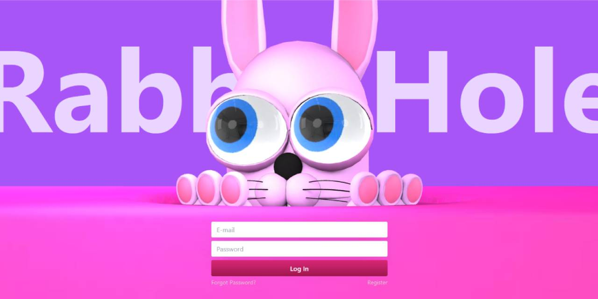

# Interactive 3d Bunny
## ThreeJS + Tailwind + Vite

### Interactive 3d model of a bunny
[Live Demo](https://interactive-3d-bunny.vercel.app)

It can move around the head following the mouse cursor.
If you write in the form fields, the bunny will move your eyes in the direction you wrote and make some animations.

Inspired by the talk by [Luigi Rosso and Guido Rosso @ Flutter Interact '19](https://www.youtube.com/watch?v=6QZy5sYozVI&t)

It could really enhance the login experience if I put more effort into it.

// TODO:
- [x] Interaction with the username field
- [x] Interaction with the password field
- [ ] Interaction with the Login button
- [ ] Manage the events and the animation in a better way
- [ ] Refactor everything

Development:

```
git clone https://github.com/RobeSantoro/Interactive3DBunny.git
npm install && npm run dev
```

ThreeJS 3D version of the 2D SVG R&D I made here:
https://github.com/RobeSantoro/AvatarSVG


